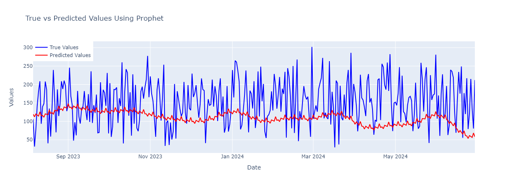
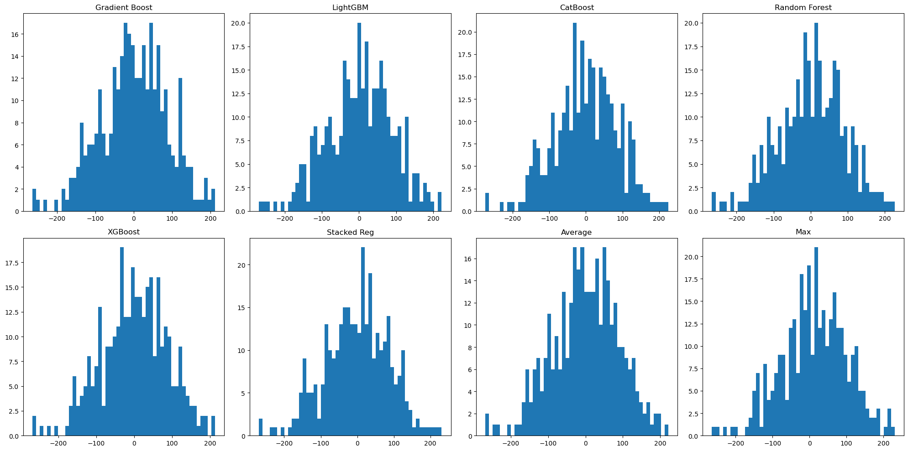

# Atm Cash Forecasting
## Feature Engineering

1. **IsHoliday**: Flags whether the day is a holiday, which often influences ATM transaction patterns.

2. **Year**: Captures the year of the transaction to analyze trends over different years.

3. **Month**: Identifies the month of the transaction to account for seasonal effects.

4. **Date**: Provides the specific day of the month for more granular analysis.

5. **DayOfWeek**: Represents the day of the week, as transaction patterns may vary by weekday vs. weekend.

6. **IsWeekend**: Indicates if the transaction occurred on a weekend, which can impact ATM usage patterns.

7. **Quarter**: The fiscal quarter to understand seasonal trends within each year.

8. **DayOfYear**: The day number within the year, useful for identifying patterns that may repeat annually.

9. **PartOfMonth**: Categorizes the transaction into different parts of the month (beginning, middle, end) to understand how transaction behavior changes over the month.

10. **TotalValueUSD**: Converts transaction values to USD for a more stable and internationally comparable metric.

11. **Last7Days_mean**: Average transaction value over the past 7 days, capturing short-term trends.

12. **Last30Days_mean**: Average transaction value over the past 30 days, capturing medium-term trends.

13. **Difference**: Measures changes in transaction value compared to previous periods, indicating deviations from typical patterns.

14. **HolidayType**: Details the type of holiday, which can affect transaction behavior differently depending on the type of holiday.

15. **Event**: Records events that might influence ATM usage, providing context to anomalies in transaction data.

16. **Paydays**: Identifies paydays, recognizing that ATM usage often spikes when people receive their paychecks.

17. **HolidaySequence**: Tracks the sequence of holidays to assess their cumulative impact on ATM usage over time.

## Results
[text](true_vs_predicted_models.html)
| Model           | MSE          | MAE          | MAPE     | R²        |
|-----------------|--------------|--------------|----------|-----------|
| Gradient Boost  | 7706.754390   | 70.036785     | 0.450142 | 0.242991  |
| LightGBM        | 7958.092438   | 71.360411     | 0.460409 | 0.218303  |
| CatBoost        | 7493.748586   | 69.045935     | 0.447735 | 0.263914  |
| Random Forest   | 8032.624521   | 71.478044     | 0.460541 | 0.210982  |
| XGBoost         | 7624.443946   | 69.895835     | 0.451133 | 0.251076  |
| Stacked Reg     | 7616.763010   | 69.839697     | 0.453305 | 0.251831  |
| Average         | 7653.172050   | 69.994031     | 0.452448 | 0.248254  |
| Max             | 7897.089496   | 71.107252     | 0.482975 | 0.224295  |

 

